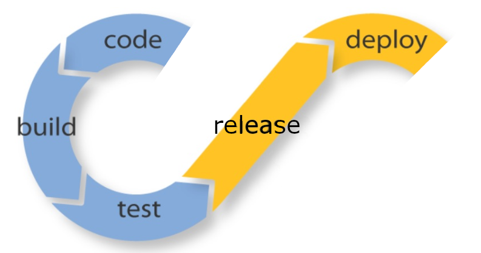

1. Whole release process starts with the end of coding stage.
2. After the commit is made, automated builds takes place.
3. Then, after successfull builds, tests come next.
4. If they all pass, we're ready for release, which means binaries are configured and prepared for deployment and software version is incremented.
5. Then we move on to deployment stage where we deliver configured binaries to target machines and perform final tests.
